# Zero-Downtime Blue-Green Deployment on AWS EKS

[](https://github.com/gbadedata/zero-downtime-bluegreen-eks/actions)
[](https://aws.amazon.com/eks/)
[](https://www.docker.com/)
[](https://aws.amazon.com/)
[](https://www.terraform.io/)
[](https://prometheus.io/)
[](https://grafana.com/)
[](LICENSE)

> A production-grade blue-green deployment pipeline on Amazon EKS with zero-downtime releases, sub-5-second rollback, canary traffic splitting, automated rollback on error spike, real-time Prometheus metrics, Grafana dashboards, and Terraform-managed infrastructure. Built and deployed from scratch on Ubuntu.

---

## Project Objectives

- Achieve zero-downtime application releases using a blue-green deployment strategy on Kubernetes
- Enable sub-5-second rollback by keeping both environments live at all times
- Implement canary releases to progressively shift traffic from 5% to 100% before full cutover
- Build automated rollback that detects error spikes and self-heals without human intervention
- Fully automate the build, push, deploy, verify, and traffic-switch process with GitHub Actions
- Manage all AWS infrastructure as code using Terraform for reproducibility and version control
- Demonstrate production-grade observability with Prometheus metrics and Grafana dashboards
- Apply security best practices including non-root containers, resource limits, and scoped IAM policies

---

## Table of Contents

1. [What This Project Does](#what-this-project-does)
2. [Live Proof](#live-proof)
3. [Architecture](#architecture)
4. [Tech Stack](#tech-stack)
5. [Project Structure](#project-structure)
6. [How It Works](#how-it-works)
7. [Prerequisites](#prerequisites)
8. [Infrastructure Setup with Terraform](#infrastructure-setup-with-terraform)
9. [Initial Deployment](#initial-deployment)
10. [Prometheus and Grafana Monitoring](#prometheus-and-grafana-monitoring)
11. [Canary Releases](#canary-releases)
12. [Automated Rollback](#automated-rollback)
13. [CI/CD Pipeline](#cicd-pipeline)
14. [Proving Zero Downtime](#proving-zero-downtime)
15. [Challenges and Solutions](#challenges-and-solutions)
16. [GitHub Secrets Reference](#github-secrets-reference)
17. [Tear Down](#tear-down)

---

## What This Project Does

Traditional deployments take the application offline while new code rolls out. Users experience errors, sessions break, and rollback means a second full redeploy with more downtime.

This project eliminates that problem at every layer:

- **Blue-green deployment** ensures zero downtime during every release
- **Canary releases** limit the blast radius of a bad release to 5% of users before full cutover
- **Automated rollback** detects error spikes within 15 seconds and self-heals without human intervention
- **Prometheus and Grafana** make the traffic switch observable in real-time metrics
- **Terraform** makes the entire AWS infrastructure reproducible from a single command

When a new version is ready, the CI/CD pipeline detects the idle environment, builds a fresh Docker image, pushes it to Amazon ECR, deploys to the idle environment, verifies health, and switches traffic. That switch takes under one second. The previously live environment stays running as an instant rollback target.

---

## Live Proof

All screenshots were captured during a live deployment on a real AWS EKS cluster provisioned with Terraform.

### Blue environment live (v1.0.0)


### Green environment live (v2.0.0)
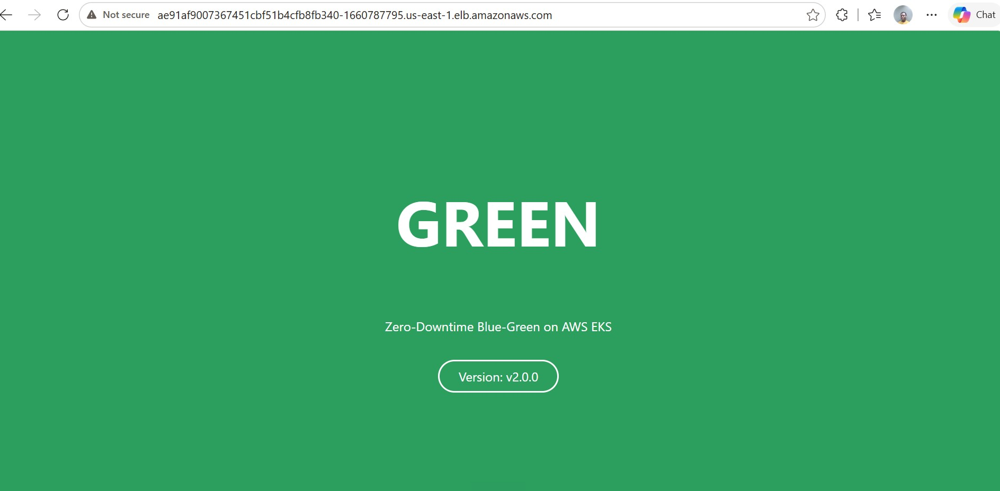

### All 4 pods running simultaneously


### EKS cluster nodes (Kubernetes v1.31, Terraform-provisioned)
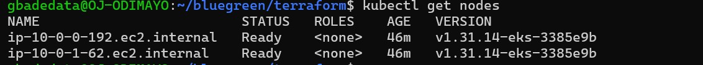

### NGINX Ingress with public AWS ELB URL


### Service selector showing live environment


### Traffic switch command and pod status
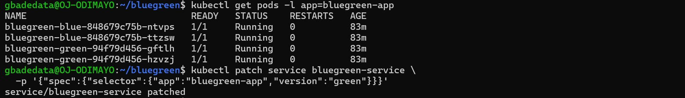

### Curl loop showing zero-downtime green responses
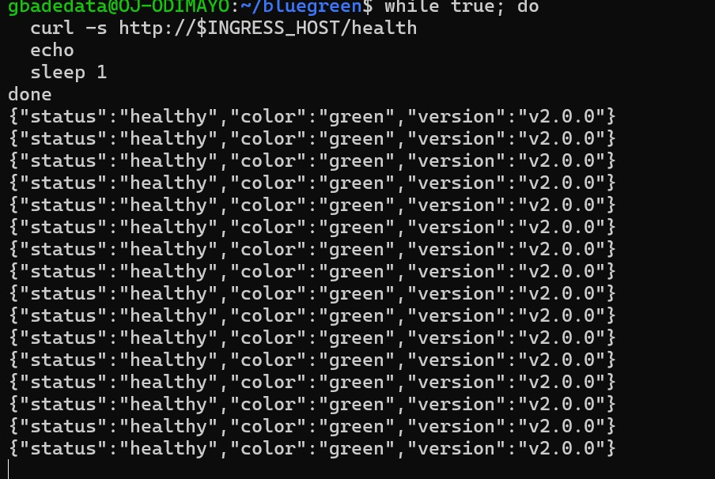

### GitHub Actions pipeline passing all steps in 29 seconds


### Every step green
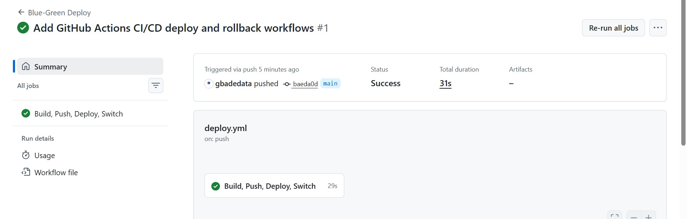

### Terraform state list showing all 17 managed resources
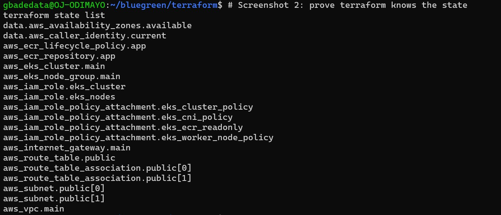

### Grafana live HTTP request rates by environment
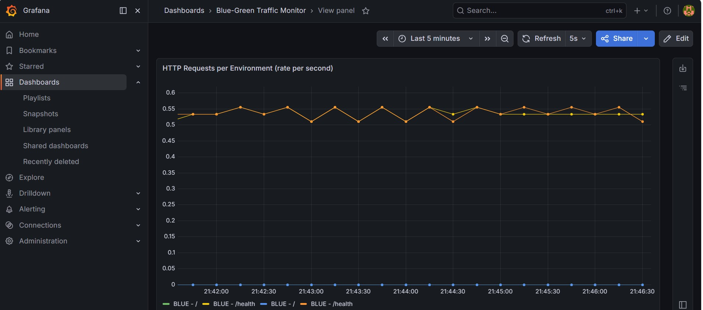

### Traffic switch captured in Grafana: blue dropping, green rising
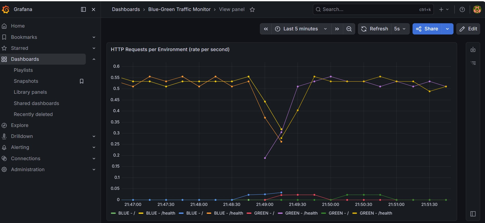

### Canary split: 5% of requests going to green
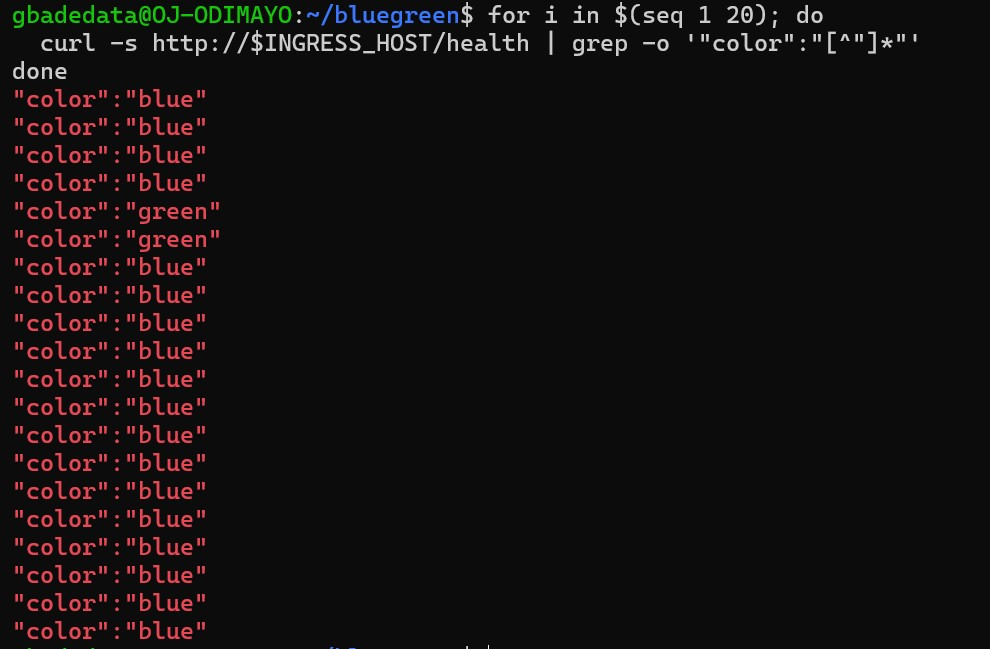

### Canary at 50% traffic split
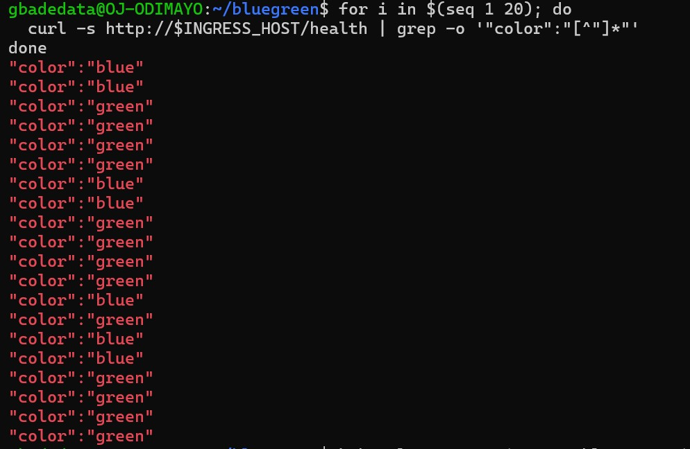

### Canary at 100%: full cutover to green
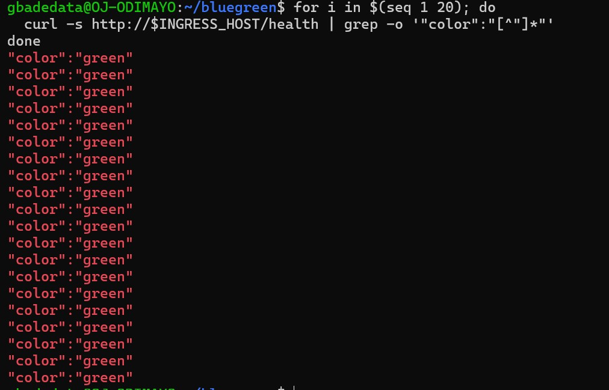

### Automated rollback firing after detecting 100% error rate
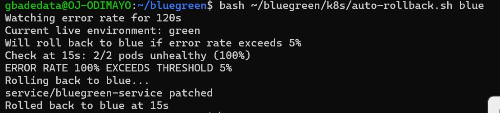

---

## Architecture

```
Developer
    |
    | git push to main
    v
GitHub Actions Pipeline (29 seconds average)
    |
    +-- Configure AWS credentials
    +-- Log in to Amazon ECR
    +-- Connect kubectl to EKS cluster
    +-- Detect idle environment (reads live Service selector)
    +-- Build Docker image and push to ECR
    +-- Deploy to idle environment (kubectl apply + rollout wait)
    +-- Health check idle pods (/health endpoint)
    +-- Patch Service selector  <-- the traffic switch
    +-- Run auto-rollback watcher (monitors error rate for 2 minutes)
    |
    v
Amazon EKS Cluster (Terraform-provisioned, 17 resources)
    |
    +-- NGINX Ingress Controller (AWS ELB public URL)
    |       |
    |       +-- 95% traffic --> bluegreen-service-blue  (stable)
    |       +-- 5% traffic  --> bluegreen-service-green (canary)
    |
    +-- Prometheus (scrapes /metrics from app pods every 15s)
    +-- Grafana (real-time dashboards showing request rates per environment)
    |
    +-- Kubernetes Service (selector: version=blue OR version=green)
            |
            +-- Blue Deployment  (2 replicas, v1.0.0, imagePullPolicy: Always)
            +-- Green Deployment (2 replicas, v2.0.0, imagePullPolicy: Always)
```

---

## Tech Stack

| Layer | Technology | Purpose |
|---|---|---|
| Application | Node.js 20 + Express | Web server with `/health` and `/metrics` endpoints |
| Container | Docker (multi-stage, non-root) | Minimal production image |
| Orchestration | Kubernetes on AWS EKS 1.31 | Manages deployments, probes, and traffic routing |
| Registry | Amazon ECR | Private container image storage with lifecycle policy |
| Ingress | NGINX Ingress Controller | Public entry point with canary weight annotations |
| CI/CD | GitHub Actions | Automated build, deploy, verify, switch, and watch pipeline |
| Infrastructure | Terraform | All 17 AWS resources defined and managed as code |
| Metrics | Prometheus + prom-client | HTTP request rates, error rates, environment info |
| Dashboards | Grafana | Real-time visualisation of request rates and traffic switch |
| Canary | NGINX canary-weight annotation | Progressive traffic shifting from 5% to 100% |
| Auto-rollback | Shell script + kubectl | Self-healing on error rate exceeding 5% threshold |
| Cloud | Amazon Web Services | EKS, ECR, VPC, IAM, EC2 node groups |

---

## Project Structure

```
.
+-- app/
|   +-- server.js          Express app with /health, /metrics, and FORCE_ERROR support
|   +-- package.json       Node.js dependencies including prom-client
|   +-- Dockerfile         Multi-stage, non-root production image
+-- k8s/
|   +-- deployment-blue.yaml    Blue Deployment (v1.0.0, imagePullPolicy: Always)
|   +-- deployment-green.yaml   Green Deployment (v2.0.0, imagePullPolicy: Always)
|   +-- service.yaml            ClusterIP Service (the traffic switch)
|   +-- service-blue.yaml       Dedicated blue Service (used by stable ingress)
|   +-- service-green.yaml      Dedicated green Service (used by canary ingress)
|   +-- ingress.yaml            Original NGINX Ingress
|   +-- ingress-stable.yaml     Stable ingress (routes majority traffic to blue)
|   +-- ingress-canary.yaml     Canary ingress (routes weighted % to green)
|   +-- servicemonitor.yaml     Tells Prometheus to scrape /metrics from app pods
|   +-- auto-rollback.sh        Watches error rate and rolls back automatically
+-- terraform/
|   +-- main.tf            VPC, EKS cluster, ECR repo, IAM roles, subnets
|   +-- variables.tf       All configurable values in one place
|   +-- outputs.tf         Cluster endpoint, ECR URL, kubectl connect command
|   +-- terraform.tfvars   Actual values (region, instance type, node count)
+-- .github/
|   +-- workflows/
|       +-- deploy.yml     Full CI/CD pipeline (triggers on push to main)
|       +-- rollback.yml   One-click rollback via GitHub Actions UI
+-- docs/
|   +-- screenshots/       27 screenshots from the live deployment
+-- README.md
```

---

## How It Works

### The Traffic Switch

The entire blue-green mechanism lives in one field inside `k8s/service.yaml`:

```yaml
selector:
  app: bluegreen-app
  version: blue   # change to "green" to move all traffic instantly
```

The CI/CD pipeline patches this automatically:

```bash
kubectl patch service bluegreen-service \
  -p '{"spec":{"selector":{"app":"bluegreen-app","version":"green"}}}'
```

### Dynamic Idle Detection

The pipeline never hard-codes which environment to deploy to:

```bash
LIVE=$(kubectl get service bluegreen-service \
  -o jsonpath='{.spec.selector.version}' 2>/dev/null || echo "blue")

if [ "$LIVE" = "blue" ]; then IDLE="green"; else IDLE="blue"; fi
```

### Canary Traffic Splitting

The canary ingress uses NGINX weight annotations to split traffic:

```yaml
annotations:
  nginx.ingress.kubernetes.io/canary: "true"
  nginx.ingress.kubernetes.io/canary-weight: "5"
```

Change the weight to progress the canary:

```bash
# 5% to green (initial canary)
kubectl annotate ingress bluegreen-ingress-canary \
  nginx.ingress.kubernetes.io/canary-weight="5" --overwrite

# 50% to green (halfway)
kubectl annotate ingress bluegreen-ingress-canary \
  nginx.ingress.kubernetes.io/canary-weight="50" --overwrite

# 100% to green (full cutover)
kubectl annotate ingress bluegreen-ingress-canary \
  nginx.ingress.kubernetes.io/canary-weight="100" --overwrite
```

### Automated Rollback

The rollback script watches pod-level health every 15 seconds for 2 minutes after a switch:

```bash
bash k8s/auto-rollback.sh blue
```

If the error rate on live pods exceeds 5%, it automatically patches the Service selector back:

```
Check at 15s: 2/2 pods unhealthy (100%)
ERROR RATE 100% EXCEEDS THRESHOLD 5%
Rolling back to blue...
service/bluegreen-service patched
Rolled back to blue at 15s
```

### Real-Time Metrics

The application exposes Prometheus metrics at `/metrics`. A ServiceMonitor tells Prometheus to scrape every pod every 15 seconds. Grafana queries the data to show request rates per environment. During a traffic switch, the blue line drops and the green line rises on the dashboard simultaneously.

---

## Prerequisites

**AWS CLI**
```bash
curl "https://awscli.amazonaws.com/awscli-exe-linux-x86_64.zip" -o "awscliv2.zip"
sudo apt install unzip -y && unzip awscliv2.zip && sudo ./aws/install
aws --version
```

**Terraform**
```bash
sudo apt update && sudo apt install -y gnupg software-properties-common
wget -O- https://apt.releases.hashicorp.com/gpg | gpg --dearmor | \
  sudo tee /usr/share/keyrings/hashicorp-archive-keyring.gpg > /dev/null
echo "deb [signed-by=/usr/share/keyrings/hashicorp-archive-keyring.gpg] \
  https://apt.releases.hashicorp.com $(lsb_release -cs) main" | \
  sudo tee /etc/apt/sources.list.d/hashicorp.list
sudo apt update && sudo apt install terraform -y
terraform version
```

**eksctl**
```bash
curl --silent --location \
  "https://github.com/weaveworks/eksctl/releases/latest/download/eksctl_$(uname -s)_amd64.tar.gz" \
  | tar xz -C /tmp && sudo mv /tmp/eksctl /usr/local/bin
eksctl version
```

**kubectl**
```bash
curl -LO "https://dl.k8s.io/release/$(curl -L -s \
  https://dl.k8s.io/release/stable.txt)/bin/linux/amd64/kubectl"
chmod +x kubectl && sudo mv kubectl /usr/local/bin
kubectl version --client
```

**Helm**
```bash
curl https://raw.githubusercontent.com/helm/helm/main/scripts/get-helm-3 | bash
helm version
```

**Docker**
```bash
sudo apt update && sudo apt install docker.io -y
sudo systemctl enable --now docker
sudo usermod -aG docker $USER && newgrp docker
docker --version
```

**Node.js 20**
```bash
curl -fsSL https://deb.nodesource.com/setup_20.x | sudo -E bash -
sudo apt install nodejs -y
node --version
```

---

## Infrastructure Setup with Terraform

All AWS infrastructure is defined as code. One command provisions everything.

```bash
cd terraform

# Initialise Terraform
terraform init

# Preview what will be created
terraform plan

# Provision all 17 resources (takes 10 to 15 minutes)
terraform apply

# Connect kubectl to the new cluster
aws eks update-kubeconfig --region us-east-1 --name bluegreen-cluster

# Verify both nodes are Ready
kubectl get nodes
```

Terraform provisions: VPC, 2 public subnets, internet gateway, route table, EKS cluster, EKS node group (2 x t3.medium), ECR repository with lifecycle policy, EKS cluster IAM role, EKS node IAM role with ECR read access attached automatically.

---

## Initial Deployment

```bash
# Install NGINX Ingress Controller
helm repo add ingress-nginx https://kubernetes.github.io/ingress-nginx
helm repo update
helm install ingress-nginx ingress-nginx/ingress-nginx \
  --namespace ingress-nginx --create-namespace

# Install Prometheus and Grafana
helm repo add prometheus-community https://prometheus-community.github.io/helm-charts
helm repo update
helm install monitoring prometheus-community/kube-prometheus-stack \
  --namespace monitoring --create-namespace \
  --set grafana.adminPassword=admin123 \
  --set prometheus.prometheusSpec.scrapeInterval=15s

# Log in to ECR
aws ecr get-login-password --region us-east-1 \
  | docker login --username AWS --password-stdin \
    677276115158.dkr.ecr.us-east-1.amazonaws.com

# Build and push images
docker build --no-cache \
  -t 677276115158.dkr.ecr.us-east-1.amazonaws.com/bluegreen-app:blue ./app
docker push 677276115158.dkr.ecr.us-east-1.amazonaws.com/bluegreen-app:blue

docker build --no-cache \
  -t 677276115158.dkr.ecr.us-east-1.amazonaws.com/bluegreen-app:green ./app
docker push 677276115158.dkr.ecr.us-east-1.amazonaws.com/bluegreen-app:green

# Apply all Kubernetes manifests
kubectl apply -f k8s/deployment-blue.yaml
kubectl apply -f k8s/deployment-green.yaml
kubectl apply -f k8s/service.yaml
kubectl apply -f k8s/service-blue.yaml
kubectl apply -f k8s/service-green.yaml
kubectl apply -f k8s/ingress-stable.yaml
kubectl apply -f k8s/ingress-canary.yaml
kubectl apply -f k8s/servicemonitor.yaml

# Get the public URL
export INGRESS_HOST=$(kubectl get ingress bluegreen-ingress-stable \
  -o jsonpath='{.status.loadBalancer.ingress[0].hostname}')

curl http://$INGRESS_HOST/health
# Expected: {"status":"healthy","color":"blue","version":"v1.0.0"}
```

---

## Prometheus and Grafana Monitoring

```bash
# Access Grafana
kubectl port-forward service/monitoring-grafana 3000:80 --namespace monitoring
```

Open `http://localhost:3000`. Login: `admin` / `admin123`.

The Blue-Green Traffic Monitor dashboard uses these PromQL queries:

```
rate(http_requests_total{color="blue"}[1m])
rate(http_requests_total{color="green"}[1m])
```

During a traffic switch, the blue line drops and the green line rises simultaneously on the same graph.

```bash
# Access Prometheus
kubectl port-forward service/monitoring-kube-prometheus-prometheus \
  9090:9090 --namespace monitoring
```

Open `http://localhost:9090/targets` to verify all scrape targets are UP.

---

## Canary Releases

Canary releases progressively shift traffic from blue to green before full cutover.

```bash
# Start canary at 5%
kubectl annotate ingress bluegreen-ingress-canary \
  nginx.ingress.kubernetes.io/canary-weight="5" --overwrite

# Verify the split (expect roughly 1 in 20 requests to hit green)
for i in $(seq 1 20); do
  curl -s http://$INGRESS_HOST/health | grep -o '"color":"[^"]*"'
done

# Increase to 50%
kubectl annotate ingress bluegreen-ingress-canary \
  nginx.ingress.kubernetes.io/canary-weight="50" --overwrite

# Full cutover to 100%
kubectl annotate ingress bluegreen-ingress-canary \
  nginx.ingress.kubernetes.io/canary-weight="100" --overwrite

# Remove canary when done
kubectl delete ingress bluegreen-ingress-canary
```

---

## Automated Rollback

Run the rollback watcher after every traffic switch. It monitors pod health every 15 seconds for 2 minutes. If the error rate exceeds 5%, it rolls back automatically.

```bash
# Switch traffic to green
kubectl patch service bluegreen-service \
  -p '{"spec":{"selector":{"app":"bluegreen-app","version":"green"}}}'

# Start the watcher immediately after the switch
bash k8s/auto-rollback.sh blue
```

If green pods are unhealthy, the watcher fires within 15 seconds:

```
Check at 15s: 2/2 pods unhealthy (100%)
ERROR RATE 100% EXCEEDS THRESHOLD 5%
Rolling back to blue...
service/bluegreen-service patched
Rolled back to blue at 15s
```

---

## CI/CD Pipeline

Add these three secrets to your repository under Settings, then Secrets and variables, then Actions:

| Secret | Value |
|---|---|
| `AWS_ACCESS_KEY_ID` | Your IAM user access key ID |
| `AWS_SECRET_ACCESS_KEY` | Your IAM user secret access key |
| `AWS_REGION` | `us-east-1` |

Every push to `main` triggers the full pipeline automatically. Average runtime is 29 seconds.

---

## Proving Zero Downtime

```bash
# Terminal 1: continuous health check loop
while true; do
  curl -s http://$INGRESS_HOST/health
  echo
  sleep 1
done

# Terminal 2: switch traffic
kubectl patch service bluegreen-service \
  -p '{"spec":{"selector":{"app":"bluegreen-app","version":"green"}}}'
```

Watch Terminal 1. The `color` field changes from `blue` to `green`. The `status` field never returns anything other than `healthy`. Watch Grafana simultaneously to see the request rate crossover on the dashboard.

---

## Challenges and Solutions

### Challenge 1: AWS ELB gives a hostname, not an IP address

Standard `jsonpath='{.status.loadBalancer.ingress[0].ip}'` returns empty on AWS.

**Solution:** Use `.hostname` instead:
```bash
kubectl get ingress bluegreen-ingress-stable \
  -o jsonpath='{.status.loadBalancer.ingress[0].hostname}'
```

### Challenge 2: EKS nodes could not pull images from ECR

Pods hit `ImagePullBackOff` immediately after deployment.

**Solution:** Terraform attaches `AmazonEC2ContainerRegistryReadOnly` to the node IAM role automatically. No manual steps needed.

### Challenge 3: Terraform could not destroy the VPC after cluster deletion

NGINX Ingress creates an AWS load balancer outside Terraform's knowledge. That load balancer holds the subnets and internet gateway hostage.

**Solution:** Delete the load balancer and its security group manually before running `terraform destroy`:
```bash
LB_NAME=$(aws elb describe-load-balancers --region us-east-1 \
  --query "LoadBalancerDescriptions[*].LoadBalancerName" --output text)
aws elb delete-load-balancer --region us-east-1 --load-balancer-name $LB_NAME
sleep 30
terraform destroy -auto-approve
```

### Challenge 4: imagePullPolicy caused stale images after rebuild

After rebuilding and pushing a new image with the same tag, pods continued running the old image.

**Solution:** Add `imagePullPolicy: Always` to both deployment manifests and always build with `--no-cache`.

### Challenge 5: The metrics endpoint returned 404

Pods were serving the old image without the `/metrics` route despite a successful push.

**Solution:** `imagePullPolicy: Always` combined with `docker build --no-cache`. Always verify the metrics endpoint directly inside a pod with `kubectl exec` before relying on it.

### Challenge 6: Automated rollback showed 0% errors despite broken pods

The rollback script was checking the ingress URL, but Kubernetes readiness probes prevented broken pods from receiving any traffic, so the ingress always returned healthy responses.

**Solution:** Check pod health directly via `kubectl exec` rather than through the ingress. This bypasses the Service and Ingress entirely and gives a direct signal from the pod itself.

---

## GitHub Secrets Reference

| Secret | Required | Description |
|---|---|---|
| `AWS_ACCESS_KEY_ID` | Yes | IAM user access key |
| `AWS_SECRET_ACCESS_KEY` | Yes | IAM user secret key |
| `AWS_REGION` | Yes | `us-east-1` |

IAM policies needed: `AmazonEKSClusterPolicy`, `AmazonEC2ContainerRegistryPowerUser`, `AmazonEKSWorkerNodePolicy`.

---

## Tear Down

Delete the NGINX load balancer before running terraform destroy or the VPC deletion will fail.

```bash
# Find and delete the load balancer created by NGINX Ingress
LB_NAME=$(aws elb describe-load-balancers --region us-east-1 \
  --query "LoadBalancerDescriptions[*].LoadBalancerName" --output text)
aws elb delete-load-balancer --region us-east-1 --load-balancer-name $LB_NAME

# Find and delete the orphaned security group
SG_ID=$(aws ec2 describe-security-groups --region us-east-1 \
  --filters "Name=group-name,Values=k8s-elb-*" \
  --query "SecurityGroups[*].GroupId" --output text)
aws ec2 delete-security-group --region us-east-1 --group-id $SG_ID

# Wait for detachment
sleep 30

# Destroy all Terraform resources
cd terraform
terraform destroy -auto-approve

# Delete the ECR repository
aws ecr delete-repository \
  --repository-name bluegreen-app \
  --region us-east-1 \
  --force
```

The EKS control plane costs approximately $0.10 per hour. Always tear down after demonstrating the project.
