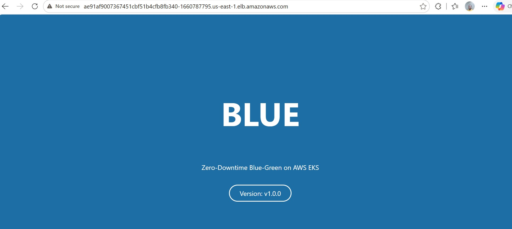
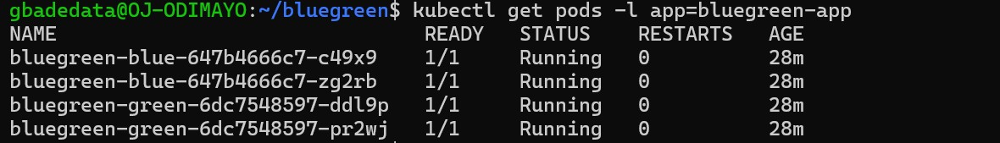
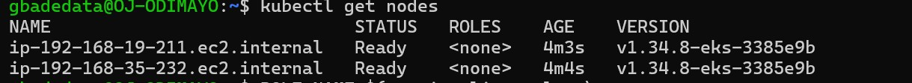
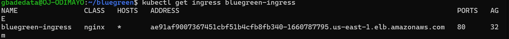
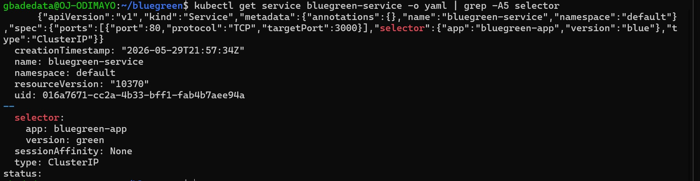
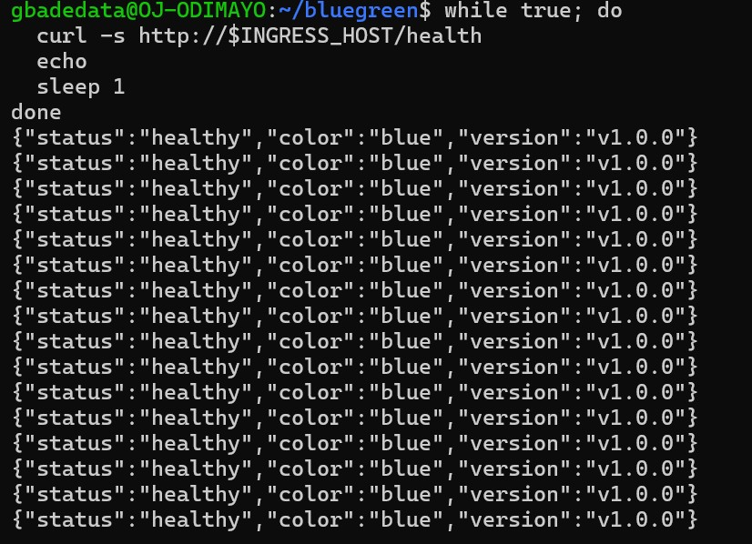
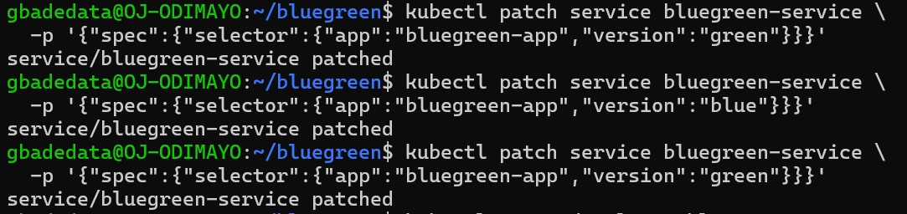
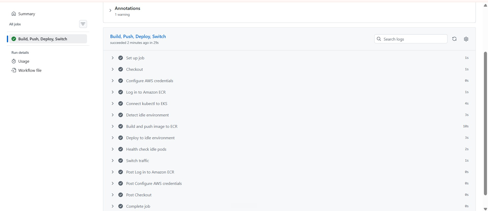

# Zero-Downtime Blue-Green Deployment on AWS EKS

[](https://github.com/gbadedata/zero-downtime-bluegreen-eks/actions)
[](https://aws.amazon.com/eks/)
[](https://www.docker.com/)
[](https://aws.amazon.com/)
[](LICENSE)

> A production-grade blue-green deployment pipeline that delivers **zero-downtime releases** and **sub-5-second rollback** on Amazon Elastic Kubernetes Service. Two identical environments run simultaneously at all times. New versions are staged, health-checked, and switched over in a single automated pipeline run averaging **29 seconds end to end**.




---

## Table of Contents

1. [What This Project Does](#what-this-project-does)
2. [Live Proof](#live-proof)
3. [Architecture](#architecture)
4. [Tech Stack](#tech-stack)
5. [Project Structure](#project-structure)
6. [How It Works](#how-it-works)
7. [Prerequisites](#prerequisites)
8. [One-Time AWS Setup](#one-time-aws-setup)
9. [Initial Deployment](#initial-deployment)
10. [CI/CD Pipeline](#cicd-pipeline)
11. [Proving Zero Downtime](#proving-zero-downtime)
12. [Rollback](#rollback)
13. [Challenges and Solutions](#challenges-and-solutions)
14. [GitHub Secrets Reference](#github-secrets-reference)
15. [Tear Down](#tear-down)

---

## What this Project Does

Traditional deployments take the application offline while new code rolls out. Users experience errors, sessions break, and rollback means a second full redeploy with more downtime.

Blue-green deployment solves this permanently. Two complete production environments, **blue** and **green**, run side by side at all times. One is live and serving all user traffic. The other is idle, ready to receive the next release.

When a new version is ready:

1. The CI/CD pipeline detects which environment is currently idle
2. It builds a fresh Docker image and pushes it to Amazon ECR
3. It deploys the new version to the idle environment
4. It waits for Kubernetes readiness probes to pass
5. It runs an explicit health check against the `/health` endpoint
6. It patches the Kubernetes Service selector from `version: blue` to `version: green`

That selector patch is the entire traffic switch. It takes under one second. Users never experience a failed request. The previously live environment stays running as an instant rollback target.

---

## Live Proof

All screenshots below were captured during a live deployment on a real AWS EKS cluster.

### Blue environment live in browser (v1.0.0)


### Green environment live in browser (v2.0.0)


### All 4 pods running simultaneously


### EKS cluster nodes


### NGINX Ingress with public AWS ELB URL


### Service selector showing live environment


### Terminal 1: continuous health check loop during the switch


### Terminal 2: the traffic switch command


### GitHub Actions pipeline passing all steps


### Every step green in 29 seconds


---

## Architecture

```
Developer
    |
    | git push to main
    v
GitHub Actions Pipeline (29 seconds average)
    |
    +-- Configure AWS credentials
    +-- Log in to Amazon ECR
    +-- Connect kubectl to EKS cluster
    +-- Detect idle environment (reads live Service selector)
    +-- Build Docker image and push to ECR
    +-- Deploy to idle environment (kubectl apply + rollout wait)
    +-- Health check idle pods (/health endpoint)
    +-- Patch Service selector  <-- this is the traffic switch
    |
    v
Amazon EKS Cluster
    |
    +-- NGINX Ingress Controller (AWS ELB public URL)
            |
            v
    Kubernetes Service
    selector: version=blue  OR  version=green
            |
            +-- Blue Deployment  (2 replicas, v1.0.0)
            +-- Green Deployment (2 replicas, v2.0.0)
```

The public URL never changes. The NGINX Ingress forwards to the Service. The Service routes to whichever environment its selector points at. Changing that selector is the entire mechanism.

---

## Tech Stack

| Layer | Technology | Purpose |
|---|---|---|
| Application | Node.js 20 + Express | Web server with `/health` endpoint and visible version banner |
| Container | Docker (multi-stage build) | Minimal, non-root production image |
| Orchestration | Kubernetes on AWS EKS | Manages blue and green deployments, probes, and scaling |
| Registry | Amazon ECR | Private container image storage |
| Ingress | NGINX Ingress Controller | Single public entry point via AWS ELB |
| CI/CD | GitHub Actions | Fully automated build, deploy, verify, and switch pipeline |
| Cloud | Amazon Web Services | EKS, ECR, IAM, EC2 node groups |

---

## Project Structure

```
.
+-- app/
|   +-- server.js            Express app with /health endpoint and version banner
|   +-- package.json         Node.js dependencies
|   +-- Dockerfile           Multi-stage, non-root production image
+-- k8s/
|   +-- deployment-blue.yaml    Blue environment Deployment (v1.0.0)
|   +-- deployment-green.yaml   Green environment Deployment (v2.0.0)
|   +-- service.yaml            ClusterIP Service (the traffic switch)
|   +-- ingress.yaml            NGINX Ingress (public ELB URL)
+-- .github/
|   +-- workflows/
|       +-- deploy.yml       Full CI/CD pipeline (triggers on push to main)
|       +-- rollback.yml     One-click rollback via GitHub Actions UI
+-- docs/
|   +-- screenshots/         Live proof from the deployed cluster
+-- README.md
```

---

## How it Works

### The Traffic Switch

The entire blue-green mechanism lives in a single field inside `k8s/service.yaml`:

```yaml
selector:
  app: bluegreen-app
  version: blue   # change this to "green" to move all traffic instantly
```

Kubernetes routes traffic only to pods that match this selector. Changing it from `blue` to `green` moves 100% of traffic to the green environment in milliseconds. No restarts, no downtime, no dropped requests.

The CI/CD pipeline does this automatically with:

```bash
kubectl patch service bluegreen-service \
  -p '{"spec":{"selector":{"app":"bluegreen-app","version":"green"}}}'
```

### Dynamic Idle Detection

The pipeline never hard-codes which environment to deploy to. It reads the current live state and computes the answer:

```bash
LIVE=$(kubectl get service bluegreen-service \
  -o jsonpath='{.spec.selector.version}' 2>/dev/null || echo "blue")

if [ "$LIVE" = "blue" ]; then IDLE="green"; else IDLE="blue"; fi
```

Run the pipeline a hundred times and it always deploys to the correct idle environment.

### Two Layers of Health Verification

Traffic only switches after two independent checks pass:

1. **Kubernetes readiness probes** gate the rollout. Pods are not marked Ready until `/health` returns 200. The pipeline waits for the full rollout before proceeding.

2. **Explicit pipeline health check** runs `wget` directly inside an idle pod against `localhost:3000/health`. This bypasses the Service and Ingress entirely, giving a clean signal that the pod itself is healthy before any user traffic touches it.

If either check fails, the pipeline stops. The live environment is untouched.

---

## Prerequisites

**AWS CLI**
```bash
curl "https://awscli.amazonaws.com/awscli-exe-linux-x86_64.zip" -o "awscliv2.zip"
sudo apt install unzip -y && unzip awscliv2.zip && sudo ./aws/install
aws --version
```

**eksctl**
```bash
curl --silent --location \
  "https://github.com/weaveworks/eksctl/releases/latest/download/eksctl_$(uname -s)_amd64.tar.gz" \
  | tar xz -C /tmp && sudo mv /tmp/eksctl /usr/local/bin
eksctl version
```

**kubectl**
```bash
curl -LO "https://dl.k8s.io/release/$(curl -L -s https://dl.k8s.io/release/stable.txt)/bin/linux/amd64/kubectl"
chmod +x kubectl && sudo mv kubectl /usr/local/bin
kubectl version --client
```

**Helm**
```bash
curl https://raw.githubusercontent.com/helm/helm/main/scripts/get-helm-3 | bash
helm version
```

**Docker**
```bash
sudo apt update && sudo apt install docker.io -y
sudo systemctl enable --now docker
sudo usermod -aG docker $USER && newgrp docker
docker --version
```

---

## One-Time AWS Setup

```bash
# Configure AWS CLI
aws configure
# Enter your Access Key ID, Secret Access Key, region (us-east-1), output (json)

# Verify connection
aws sts get-caller-identity

# Create ECR repository
aws ecr create-repository \
  --repository-name bluegreen-app \
  --region us-east-1

# Create EKS cluster (takes 10 to 15 minutes)
eksctl create cluster \
  --name    bluegreen-cluster \
  --region  us-east-1 \
  --nodes   2 \
  --node-type t3.medium

# Verify nodes are Ready
kubectl get nodes

# Attach ECR pull permissions to node IAM role
ROLE_NAME=$(aws iam list-roles \
  --query "Roles[?contains(RoleName,'NodeInstanceRole')].RoleName" \
  --output text)

aws iam attach-role-policy \
  --role-name  "$ROLE_NAME" \
  --policy-arn arn:aws:iam::aws:policy/AmazonEC2ContainerRegistryReadOnly

# Install NGINX Ingress Controller
helm repo add ingress-nginx https://kubernetes.github.io/ingress-nginx && helm repo update

helm install ingress-nginx ingress-nginx/ingress-nginx \
  --namespace ingress-nginx \
  --create-namespace

# Wait for the ELB hostname (2 to 3 minutes)
kubectl get service ingress-nginx-controller --namespace ingress-nginx --watch
```

---

## Initial Deployment

```bash
# Log in to ECR
aws ecr get-login-password --region us-east-1 \
  | docker login --username AWS --password-stdin \
    677276115158.dkr.ecr.us-east-1.amazonaws.com

# Build and push both images
docker build -t 677276115158.dkr.ecr.us-east-1.amazonaws.com/bluegreen-app:blue ./app
docker push 677276115158.dkr.ecr.us-east-1.amazonaws.com/bluegreen-app:blue

docker build -t 677276115158.dkr.ecr.us-east-1.amazonaws.com/bluegreen-app:green ./app
docker push 677276115158.dkr.ecr.us-east-1.amazonaws.com/bluegreen-app:green

# Apply all Kubernetes manifests
kubectl apply -f k8s/deployment-blue.yaml
kubectl apply -f k8s/deployment-green.yaml
kubectl apply -f k8s/service.yaml
kubectl apply -f k8s/ingress.yaml

# Verify all 4 pods are running
kubectl get pods -l app=bluegreen-app

# Get the public URL
export INGRESS_HOST=$(kubectl get ingress bluegreen-ingress \
  -o jsonpath='{.status.loadBalancer.ingress[0].hostname}')

curl http://$INGRESS_HOST/health
# Expected: {"status":"healthy","color":"blue","version":"v1.0.0"}
```

---

## CI/CD Pipeline

Add these three secrets to your repository under Settings, then Secrets and variables, then Actions:

| Secret | Value |
|---|---|
| `AWS_ACCESS_KEY_ID` | Your IAM user access key ID |
| `AWS_SECRET_ACCESS_KEY` | Your IAM user secret access key |
| `AWS_REGION` | `us-east-1` |

Every push to `main` triggers the full pipeline automatically. The pipeline detects the idle environment, builds and pushes a new image, deploys it, verifies health, and switches traffic. Average runtime is 29 seconds.

---

## Proving Zero Downtime

Run this loop in Terminal 1 before triggering a deploy:

```bash
while true; do
  curl -s http://$INGRESS_HOST/health
  echo
  sleep 1
done
```

While the loop runs, trigger the pipeline with a push or switch manually in Terminal 2:

```bash
kubectl patch service bluegreen-service \
  -p '{"spec":{"selector":{"app":"bluegreen-app","version":"green"}}}'
```

Watch Terminal 1. The `color` field changes from `blue` to `green` mid-stream. The `status` field never returns anything other than `healthy`. Every request succeeds throughout the switch.

---

## Rollback

**Option A: GitHub Actions UI (recommended)**

Go to Actions, select the Rollback workflow, click Run workflow, choose `blue` or `green`, confirm. Done in under 5 seconds.

**Option B: Command line**

```bash
# Roll back to blue
kubectl patch service bluegreen-service \
  -p '{"spec":{"selector":{"app":"bluegreen-app","version":"blue"}}}'

# Confirm the active environment
kubectl get service bluegreen-service \
  -o jsonpath='{.spec.selector.version}'
```

---

## Challenges and Solutions

### Challenge 1: AWS ELB gives a hostname, not an IP address

On Azure, the Ingress EXTERNAL-IP is a plain IP address. On AWS, it is a long ELB hostname. The standard `jsonpath='{.status.loadBalancer.ingress[0].ip}'` returns empty on AWS.

**Solution:** Use `.hostname` instead of `.ip` for the jsonpath query:
```bash
kubectl get ingress bluegreen-ingress \
  -o jsonpath='{.status.loadBalancer.ingress[0].hostname}'
```
Store it as `INGRESS_HOST` rather than `INGRESS_IP` to avoid confusion.

---

### Challenge 2: EKS nodes could not pull images from ECR

After deploying the manifests, pods were stuck in `ImagePullBackOff`. The cluster had no permission to access the private ECR registry.

**Solution:** Attach the `AmazonEC2ContainerRegistryReadOnly` IAM policy directly to the EKS node instance role. This grants all nodes in the cluster pull access to ECR without hard-coding credentials anywhere:
```bash
aws iam attach-role-policy \
  --role-name  "$ROLE_NAME" \
  --policy-arn arn:aws:iam::aws:policy/AmazonEC2ContainerRegistryReadOnly
```

---

### Challenge 3: The GitHub Actions workflow files were never pushed

The pipeline ran successfully when triggered, but the Actions tab showed the "Get started" page instead of workflow runs. The `.github/workflows/` folder existed locally but was empty because the workflow files had been created in a downloaded ZIP rather than on the Ubuntu machine directly.

**Solution:** Create the workflow files directly on the Ubuntu machine using `cat` heredocs and push them explicitly with `git add .github/`. Confirmed by checking `ls -la .github/workflows/` before committing.

---

### Challenge 4: Timing the health check gate correctly

Early runs of the pipeline switched traffic before the idle pods were fully ready, causing a brief period where some requests hit pods that had not finished starting up.

**Solution:** Two-stage verification: first `kubectl rollout status` waits for all pods to pass their readiness probes, then an explicit `kubectl exec` health check runs a direct request inside one idle pod. Traffic only switches after both pass independently.

---

## GitHub Secrets Reference

| Secret | Required | Description |
|---|---|---|
| `AWS_ACCESS_KEY_ID` | Yes | IAM user access key |
| `AWS_SECRET_ACCESS_KEY` | Yes | IAM user secret key |
| `AWS_REGION` | Yes | AWS region (e.g. `us-east-1`) |

The IAM user needs these policies:
- `AmazonEKSClusterPolicy`
- `AmazonEC2ContainerRegistryPowerUser`
- `AmazonEKSWorkerNodePolicy`

---

## Tear Down

Delete all resources when finished to avoid ongoing charges. The EKS control plane costs approximately $0.10 per hour.

```bash
eksctl delete cluster --name bluegreen-cluster --region us-east-1

aws ecr delete-repository \
  --repository-name bluegreen-app \
  --region us-east-1 \
  --force
```

---

## Project Type and Purpose

This is a DevOps infrastructure project. The web application (Node.js/Express) is intentionally minimal because the focus is entirely on the deployment strategy. The visible color and version banner exist to make the traffic switch observable and demonstrable during a live presentation.

**Project objectives:**

- Achieve zero-downtime application releases using a blue-green deployment strategy on Kubernetes
- Enable sub-5-second rollback by keeping both environments live at all times
- Fully automate the build, push, deploy, verify, and traffic-switch process with GitHub Actions
- Demonstrate production-grade container orchestration on AWS EKS
- Apply security best practices including non-root containers, resource limits, and scoped IAM policies
