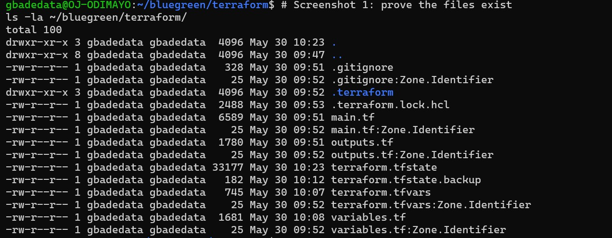

# Zero-Downtime Blue-Green Deployment on AWS EKS

[](https://github.com/gbadedata/zero-downtime-bluegreen-eks/actions)
[](https://aws.amazon.com/eks/)
[](https://www.docker.com/)
[](https://aws.amazon.com/)
[](https://www.terraform.io/)
[](https://prometheus.io/)
[](https://grafana.com/)
[](LICENSE)

> A production-grade blue-green deployment pipeline on Amazon EKS with zero-downtime releases, sub-5-second rollback, real-time Prometheus metrics, Grafana dashboards, and Terraform-managed infrastructure. Built and deployed from scratch on Ubuntu.

---

## Table of Contents

1. [What This Project Does](#what-this-project-does)
2. [Live Proof](#live-proof)
3. [Architecture](#architecture)
4. [Tech Stack](#tech-stack)
5. [Project Structure](#project-structure)
6. [How It Works](#how-it-works)
7. [Prerequisites](#prerequisites)
8. [Infrastructure Setup with Terraform](#infrastructure-setup-with-terraform)
9. [Initial Deployment](#initial-deployment)
10. [Prometheus and Grafana Monitoring](#prometheus-and-grafana-monitoring)
11. [CI/CD Pipeline](#cicd-pipeline)
12. [Proving Zero Downtime](#proving-zero-downtime)
13. [Rollback](#rollback)
14. [Challenges and Solutions](#challenges-and-solutions)
15. [GitHub Secrets Reference](#github-secrets-reference)
16. [Tear Down](#tear-down)

---

## What This Project Does

Traditional deployments take the application offline while new code rolls out. Users experience errors, sessions break, and rollback means a second full redeploy with more downtime.

Blue-green deployment solves this permanently. Two complete production environments, **blue** and **green**, run side by side at all times. One is live and serving all user traffic. The other is idle, ready to receive the next release.

When a new version is ready, the CI/CD pipeline:

1. Detects which environment is currently idle
2. Builds a fresh Docker image and pushes it to Amazon ECR
3. Deploys the new version to the idle environment
4. Waits for Kubernetes readiness probes to pass
5. Runs an explicit health check against the `/health` endpoint
6. Patches the Kubernetes Service selector to switch all traffic instantly
7. Prometheus captures the switch in real-time metrics visible in Grafana

That selector patch is the entire traffic switch. It takes under one second. Users never experience a failed request. The previously live environment stays running as an instant rollback target.

---

## Live Proof

All screenshots below were captured during a live deployment on a real AWS EKS cluster provisioned with Terraform.

### Blue environment live (v1.0.0)


### Green environment live (v2.0.0)


### All 4 pods running simultaneously


### EKS cluster nodes (Kubernetes v1.31)


### NGINX Ingress with public AWS ELB URL


### Service selector showing live environment


### Terminal showing the traffic switch command


### Curl loop showing zero-downtime green responses


### GitHub Actions pipeline passing all steps in 29 seconds


### Every step green


### Terraform state list showing all 17 managed resources


### Terraform infrastructure files


### Grafana live HTTP request rates by environment


### The traffic switch captured in Grafana: blue dropping, green rising


---

## Architecture

```
Developer
    |
    | git push to main
    v
GitHub Actions Pipeline (29 seconds average)
    |
    +-- Configure AWS credentials
    +-- Log in to Amazon ECR
    +-- Connect kubectl to EKS cluster
    +-- Detect idle environment (reads live Service selector)
    +-- Build Docker image and push to ECR
    +-- Deploy to idle environment (kubectl apply + rollout wait)
    +-- Health check idle pods (/health endpoint)
    +-- Patch Service selector  <-- the traffic switch
    |
    v
Amazon EKS Cluster (Terraform-provisioned)
    |
    +-- NGINX Ingress Controller (AWS ELB public URL)
    |
    +-- Prometheus (scrapes /metrics from app pods every 15s)
    |
    +-- Grafana (real-time dashboards showing request rates per environment)
    |
    +-- Kubernetes Service (selector: version=blue OR version=green)
            |
            +-- Blue Deployment  (2 replicas, v1.0.0)
            +-- Green Deployment (2 replicas, v2.0.0)
```

The public URL never changes. Prometheus scrapes both environments simultaneously. Changing the Service selector moves all traffic while Grafana captures the transition in real-time metrics.

---

## Tech Stack

| Layer | Technology | Purpose |
|---|---|---|
| Application | Node.js 20 + Express | Web server with `/health` and `/metrics` endpoints |
| Container | Docker (multi-stage, non-root) | Minimal production image |
| Orchestration | Kubernetes on AWS EKS 1.31 | Manages deployments, probes, and traffic routing |
| Registry | Amazon ECR | Private container image storage |
| Ingress | NGINX Ingress Controller | Single public entry point via AWS ELB |
| CI/CD | GitHub Actions | Automated build, deploy, verify, and switch pipeline |
| Infrastructure | Terraform | All AWS resources defined as code |
| Metrics | Prometheus + prom-client | HTTP request rates, error rates, environment info |
| Dashboards | Grafana | Real-time visualisation of the traffic switch |
| Cloud | Amazon Web Services | EKS, ECR, VPC, IAM, EC2 node groups |

---

## Project Structure

```
.
+-- app/
|   +-- server.js          Express app with /health and /metrics endpoints
|   +-- package.json       Node.js dependencies including prom-client
|   +-- Dockerfile         Multi-stage, non-root production image
+-- k8s/
|   +-- deployment-blue.yaml    Blue Deployment (v1.0.0, imagePullPolicy: Always)
|   +-- deployment-green.yaml   Green Deployment (v2.0.0, imagePullPolicy: Always)
|   +-- service.yaml            ClusterIP Service (the traffic switch)
|   +-- ingress.yaml            NGINX Ingress (public ELB URL)
|   +-- servicemonitor.yaml     Tells Prometheus to scrape /metrics from app pods
+-- terraform/
|   +-- main.tf            VPC, EKS cluster, ECR repo, IAM roles, subnets
|   +-- variables.tf       All configurable values in one place
|   +-- outputs.tf         Cluster endpoint, ECR URL, kubectl connect command
|   +-- terraform.tfvars   Actual values (region, instance type, node count)
+-- .github/
|   +-- workflows/
|       +-- deploy.yml     Full CI/CD pipeline (triggers on push to main)
|       +-- rollback.yml   One-click rollback via GitHub Actions UI
+-- docs/
|   +-- screenshots/       23 screenshots from the live deployment
+-- README.md
```

---

## How It Works

### The Traffic Switch

The entire blue-green mechanism lives in one field inside `k8s/service.yaml`:

```yaml
selector:
  app: bluegreen-app
  version: blue   # change to "green" to move all traffic instantly
```

The CI/CD pipeline patches this automatically:

```bash
kubectl patch service bluegreen-service \
  -p '{"spec":{"selector":{"app":"bluegreen-app","version":"green"}}}'
```

### Dynamic Idle Detection

The pipeline never hard-codes which environment to deploy to:

```bash
LIVE=$(kubectl get service bluegreen-service \
  -o jsonpath='{.spec.selector.version}' 2>/dev/null || echo "blue")

if [ "$LIVE" = "blue" ]; then IDLE="green"; else IDLE="blue"; fi
```

Run the pipeline a hundred times and it always deploys to the correct idle environment.

### Real-Time Metrics

The application exposes a `/metrics` endpoint using `prom-client`:

```javascript
const httpRequests = new client.Counter({
  name: "http_requests_total",
  help: "Total HTTP requests by route, status, color and version",
  labelNames: ["method", "route", "status", "color", "version"],
});
```

A Kubernetes ServiceMonitor tells Prometheus to scrape this endpoint every 15 seconds. Grafana queries the resulting data to show request rates per environment in real time. During a traffic switch, the blue line drops and the green line rises on the dashboard simultaneously.

---

## Prerequisites

**AWS CLI**
```bash
curl "https://awscli.amazonaws.com/awscli-exe-linux-x86_64.zip" -o "awscliv2.zip"
sudo apt install unzip -y && unzip awscliv2.zip && sudo ./aws/install
aws --version
```

**Terraform**
```bash
sudo apt update && sudo apt install -y gnupg software-properties-common
wget -O- https://apt.releases.hashicorp.com/gpg | gpg --dearmor | \
  sudo tee /usr/share/keyrings/hashicorp-archive-keyring.gpg > /dev/null
echo "deb [signed-by=/usr/share/keyrings/hashicorp-archive-keyring.gpg] \
  https://apt.releases.hashicorp.com $(lsb_release -cs) main" | \
  sudo tee /etc/apt/sources.list.d/hashicorp.list
sudo apt update && sudo apt install terraform -y
terraform version
```

**eksctl**
```bash
curl --silent --location \
  "https://github.com/weaveworks/eksctl/releases/latest/download/eksctl_$(uname -s)_amd64.tar.gz" \
  | tar xz -C /tmp && sudo mv /tmp/eksctl /usr/local/bin
eksctl version
```

**kubectl**
```bash
curl -LO "https://dl.k8s.io/release/$(curl -L -s https://dl.k8s.io/release/stable.txt)/bin/linux/amd64/kubectl"
chmod +x kubectl && sudo mv kubectl /usr/local/bin
kubectl version --client
```

**Helm**
```bash
curl https://raw.githubusercontent.com/helm/helm/main/scripts/get-helm-3 | bash
helm version
```

**Docker**
```bash
sudo apt update && sudo apt install docker.io -y
sudo systemctl enable --now docker
sudo usermod -aG docker $USER && newgrp docker
docker --version
```

**Node.js 20**
```bash
curl -fsSL https://deb.nodesource.com/setup_20.x | sudo -E bash -
sudo apt install nodejs -y
node --version
```

---

## Infrastructure Setup with Terraform

All AWS infrastructure is defined as code. One command provisions everything.

```bash
cd terraform

# Initialise Terraform
terraform init

# Preview what will be created
terraform plan

# Provision all 17 resources (takes 10 to 15 minutes)
terraform apply

# Connect kubectl to the new cluster
aws eks update-kubeconfig --region us-east-1 --name bluegreen-cluster

# Verify both nodes are Ready
kubectl get nodes
```

Terraform provisions: VPC, 2 public subnets, internet gateway, route table, EKS cluster, EKS node group (2 x t3.medium), ECR repository with lifecycle policy, EKS cluster IAM role, EKS node IAM role with ECR read access.

---

## Initial Deployment

```bash
# Install NGINX Ingress Controller
helm repo add ingress-nginx https://kubernetes.github.io/ingress-nginx && helm repo update
helm install ingress-nginx ingress-nginx/ingress-nginx \
  --namespace ingress-nginx --create-namespace

# Install Prometheus and Grafana
helm repo add prometheus-community https://prometheus-community.github.io/helm-charts && helm repo update
helm install monitoring prometheus-community/kube-prometheus-stack \
  --namespace monitoring --create-namespace \
  --set grafana.adminPassword=admin123 \
  --set prometheus.prometheusSpec.scrapeInterval=15s

# Log in to ECR and push images
aws ecr get-login-password --region us-east-1 \
  | docker login --username AWS --password-stdin \
    677276115158.dkr.ecr.us-east-1.amazonaws.com

docker build --no-cache \
  -t 677276115158.dkr.ecr.us-east-1.amazonaws.com/bluegreen-app:blue ./app
docker push 677276115158.dkr.ecr.us-east-1.amazonaws.com/bluegreen-app:blue

docker build --no-cache \
  -t 677276115158.dkr.ecr.us-east-1.amazonaws.com/bluegreen-app:green ./app
docker push 677276115158.dkr.ecr.us-east-1.amazonaws.com/bluegreen-app:green

# Apply all Kubernetes manifests
kubectl apply -f k8s/deployment-blue.yaml
kubectl apply -f k8s/deployment-green.yaml
kubectl apply -f k8s/service.yaml
kubectl apply -f k8s/ingress.yaml
kubectl apply -f k8s/servicemonitor.yaml

# Get the public URL (AWS uses a hostname, not an IP)
export INGRESS_HOST=$(kubectl get ingress bluegreen-ingress \
  -o jsonpath='{.status.loadBalancer.ingress[0].hostname}')

curl http://$INGRESS_HOST/health
# Expected: {"status":"healthy","color":"blue","version":"v1.0.0"}
```

---

## Prometheus and Grafana Monitoring

### Access Grafana

```bash
kubectl port-forward service/monitoring-grafana 3000:80 --namespace monitoring
```

Open `http://localhost:3000`. Login: `admin` / `admin123`.

### View the Blue-Green Traffic Dashboard

Import dashboard ID `15757` for the full Kubernetes cluster view, or use the custom Blue-Green Traffic Monitor dashboard which shows HTTP request rates per environment using this PromQL query:

```
rate(http_requests_total{color="blue"}[1m])
rate(http_requests_total{color="green"}[1m])
```

### What Grafana Shows During a Traffic Switch

When the Service selector is patched from blue to green, Grafana shows the blue request rate dropping to zero and the green request rate climbing up in real time. The crossover is visible on the same graph at the exact moment of the switch.

### Access Prometheus

```bash
kubectl port-forward service/monitoring-kube-prometheus-prometheus 9090:9090 --namespace monitoring
```

Open `http://localhost:9090/targets` to verify all scrape targets are UP including the bluegreen-app pods.

---

## CI/CD Pipeline

Add these three secrets to your repository under Settings, then Secrets and variables, then Actions:

| Secret | Value |
|---|---|
| `AWS_ACCESS_KEY_ID` | Your IAM user access key ID |
| `AWS_SECRET_ACCESS_KEY` | Your IAM user secret access key |
| `AWS_REGION` | `us-east-1` |

Every push to `main` triggers the full pipeline automatically. Average runtime is 29 seconds.

---

## Proving Zero Downtime

Run this loop in Terminal 1 before triggering a deploy:

```bash
while true; do
  curl -s http://$INGRESS_HOST/health
  echo
  sleep 1
done
```

Switch traffic in Terminal 2:

```bash
kubectl patch service bluegreen-service \
  -p '{"spec":{"selector":{"app":"bluegreen-app","version":"green"}}}'
```

Watch Terminal 1. The `color` field changes from `blue` to `green`. The `status` field never returns anything other than `healthy`. Watch Grafana simultaneously to see the request rate crossover on the dashboard.

---

## Rollback

**Option A: GitHub Actions UI**

Go to Actions, select the Rollback workflow, click Run workflow, choose the target environment, confirm. Done in under 5 seconds.

**Option B: Command line**

```bash
kubectl patch service bluegreen-service \
  -p '{"spec":{"selector":{"app":"bluegreen-app","version":"blue"}}}'
```

---

## Challenges and Solutions

### Challenge 1: AWS ELB gives a hostname, not an IP address

Standard `jsonpath='{.status.loadBalancer.ingress[0].ip}'` returns empty on AWS.

**Solution:** Use `.hostname` instead:
```bash
kubectl get ingress bluegreen-ingress \
  -o jsonpath='{.status.loadBalancer.ingress[0].hostname}'
```

### Challenge 2: EKS nodes could not pull images from ECR

Pods hit `ImagePullBackOff` immediately after deployment.

**Solution:** Terraform attaches `AmazonEC2ContainerRegistryReadOnly` to the node IAM role automatically. No manual steps needed.

### Challenge 3: Terraform could not destroy the VPC after cluster deletion

NGINX Ingress creates an AWS load balancer outside Terraform's knowledge. That load balancer holds the subnets and internet gateway hostage.

**Solution:** Delete the load balancer and its security group manually before running `terraform destroy`:
```bash
aws elb delete-load-balancer --region us-east-1 --load-balancer-name <name>
aws ec2 delete-security-group --region us-east-1 --group-id <sg-id>
terraform destroy -auto-approve
```

### Challenge 4: imagePullPolicy caused stale images

After rebuilding and pushing a new image with the same tag, pods continued running the old image because Kubernetes cached it.

**Solution:** Add `imagePullPolicy: Always` to both deployment manifests so every pod restart pulls the latest image from ECR.

### Challenge 5: The metrics endpoint returned 404 in early deployments

The `/metrics` route existed in the code but pods served the old image without it.

**Solution:** Build images with `--no-cache`, add `imagePullPolicy: Always` to manifests, and always test the metrics endpoint directly inside a pod with `kubectl exec` before relying on it.

---

## GitHub Secrets Reference

| Secret | Required | Description |
|---|---|---|
| `AWS_ACCESS_KEY_ID` | Yes | IAM user access key |
| `AWS_SECRET_ACCESS_KEY` | Yes | IAM user secret key |
| `AWS_REGION` | Yes | `us-east-1` |

IAM policies needed: `AmazonEKSClusterPolicy`, `AmazonEC2ContainerRegistryPowerUser`, `AmazonEKSWorkerNodePolicy`.

---

## Tear Down

**Important:** Delete the NGINX load balancer before running terraform destroy or the VPC deletion will fail.

```bash
# Find and delete the load balancer created by NGINX Ingress
LB_NAME=$(aws elb describe-load-balancers --region us-east-1 \
  --query "LoadBalancerDescriptions[*].LoadBalancerName" --output text)
aws elb delete-load-balancer --region us-east-1 --load-balancer-name $LB_NAME

# Wait 30 seconds then destroy all Terraform resources
sleep 30
cd terraform
terraform destroy -auto-approve

# Delete the ECR repository
aws ecr delete-repository \
  --repository-name bluegreen-app \
  --region us-east-1 \
  --force
```

The EKS control plane costs approximately $0.10 per hour. Always tear down after demonstrating the project.

---

## Project Objectives

- Achieve zero-downtime application releases using a blue-green deployment strategy on Kubernetes
- Enable sub-5-second rollback by keeping both environments live at all times
- Fully automate the build, push, deploy, verify, and traffic-switch process with GitHub Actions
- Manage all AWS infrastructure as code using Terraform for reproducibility
- Demonstrate production-grade observability with Prometheus metrics and Grafana dashboards
- Apply security best practices including non-root containers, resource limits, and scoped IAM policies

---

## Author

**Gbade** [@gbadedata](https://github.com/gbadedata)

Built as a solo capstone project for TechCrush, demonstrating production-grade DevOps practices on AWS EKS from scratch on Ubuntu.

`Docker` `Kubernetes` `GitHub Actions` `AWS EKS` `Terraform` `Prometheus` `Grafana` `NGINX` `Node.js`
